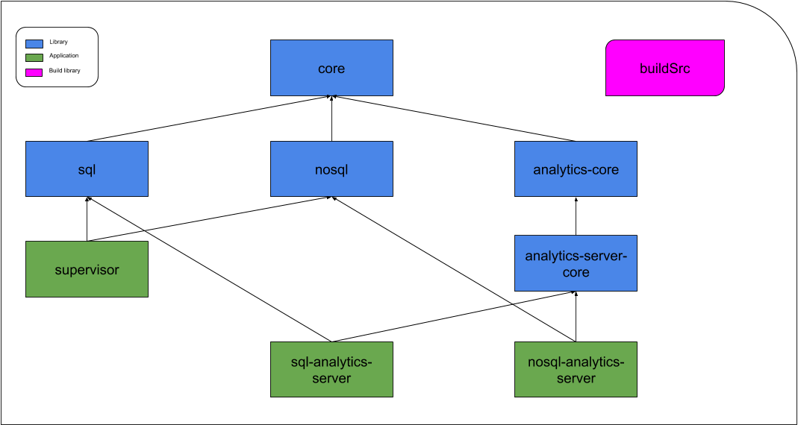
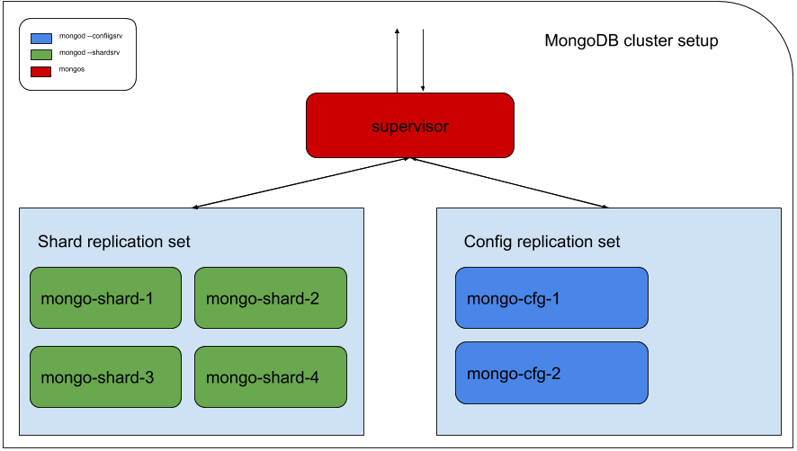
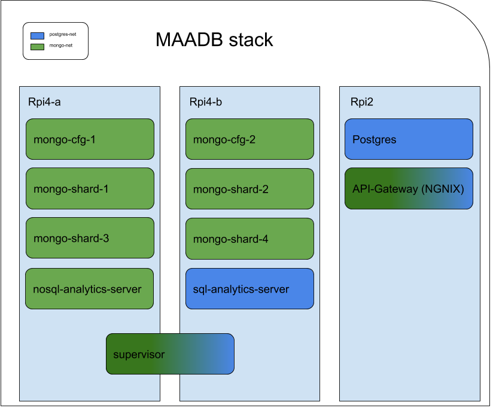

# MAADB Project [](https://travis-ci.org/lamba92/maadb-project)

##Overview
This project consists on different type of resources:
- twitter messages: datasets of real twitters associated to a sentiment
- lexical resources:
    - list of words associated to a sentiment
    - list of words or symbols that are related to the sentence

For each word found in the Twitter messages we have three purposes: 
1. check if the word is listed in all related resource.
2. count the number of occurrences of each word in the Twitter messages for each emotion.
3. draw a word cloud associated to the most frequent words in each emotion.

### Tech
Tools used to develop:

* [Docker] - Enterprise-grade containerization solution.
* [Docker Swarm] - Simple and fast Orchestrator for Docker.
* [Kotlin] - Programming Language
* [Ktor] - Framework for building asynchronous servers and clients in connected systems
* [Exposed] - Relational ORM for Kotlin
* [KMongo] - Kotlin API for MongoDB

##Our Solution
The solution works on two different type of database:

- SQL (PostgreSQL)
- NoSQL (MongoDB)

In particular, we take advantage of Docker to run our databases on a cluster:
 - 2x Raspberry Pi v4 (Ubuntu 20.04, ARM64, 4GB RAM).
 - 1x Raspberry Pi v2b (Ubuntu 20.04, ARM32, 1GB RAM).
Moreover, we created a MongoDB with shard and replication and implemented map reduction to retrieve data and statistics.

### Project Architecture



The project has 8 modules and a build project. The libraries are all published on Bintray while the applications are 
published as Docker images on the Docker Hub.

### MongoDB cluster



The Mongo DB cluster consists in 4 `mongod` instances that shards the data and 2 `mongod` instances that replicates 
the database configuration settings. the cluster is coordinated by a `mongos` router instance that exposes the cluster 
to clients.

###Elaboration
The first step was to get tweets and elaborate them:


- remove URL and USERNAME
- remove the hashtags
- remove and create a relative list of emoji and emoticons
- find and replace punctuation with no space
- transform to lower case
- tokenizing
- using the slang words and acronyms file to replace them
- POS Tagging
- stemming
- removing the stop words
- count the stem frequency
- adding the result to a dictionary

### Docker



[`maadb-stack.yml`](maadb-stack.yml) declared all the services shown in the image above. 

The stack runs on two different networks (one for SQL, another for NoSQL)
```yml
networks:
  mongo-net:
  postgres-net:
```
The [`supervisor`](maadb-stack.yml#L70-101) container is in charge of setting up the MongoDB cluster and populate both the MongoDB cluster and PostgreSQL. 

The [`api-gateway`](maadb-stack.yml#L107-204) exposes both for SQL and NoSQL services as RESTfull APIs. The [`nginx.conf`](nginx.conf) is available in the repository.

NB: due to a bug in Ktor (Ktor issue [here](https://github.com/ktorio/ktor/issues/1933) and NGINX issue [here](https://trac.nginx.org/nginx/ticket/2000)) it is not possible to query the word clouds through the API gateway. As workaround the SQL services are exposed at port `8083` and NoSQL services at `8084`.

### Get some data

All endpoints should be prefixed with either `/sql/` or `/nosql/`. Each will address the correct services and data sources with the exact same functionalities:

```
/{sql|nosql}/{statistics|wordClouds}/{tweets|hashtags|emoticons|emojis}/{sentiment}`

/{sql|nosql}/data/tweets/{sentiment}?pageSize={integer}&page={integer}
```

All combinations will retrieve different information based on the url shape. The types of the responses can be typed using the classes available in [`analitycs-core`](analytics-core/src/jvmMain/kotlin/edu/unito/maadb/sql/analytics/core/TweetsStatisticsResult.kt).

Some examples: 
`http://192.168.1.158/sql/statistics/tweets/anger`:
```json
{
  "sentiment": "ANGER",
  "wordsWithOccurrences": {
    "fuck": 20,
    "spell": 3,
    "fire": 3,
    "noo": 4,
    ...
    "cream": 1
  },
  "newWordsNotInResources": [
    "fuck",
    "spell",
    "fire",
    "noo",
    ...
    "cream"
  ],
  "timeInMilliseconds": 315
}
```
`http://192.168.1.158/sql/wordClouds/hashtags/joy`:


[Docker]: <https://www.docker.com>
[Docker Swarm]: <https://docs.docker.com/engine/swarm/>
[Kotlin]: <https://kotlinlang.org> 
[Ktor]: <https://ktor.io>
[Exposed]: <https://github.com/JetBrains/Exposed>
[KMongo]: <https://litote.org/kmongo>
